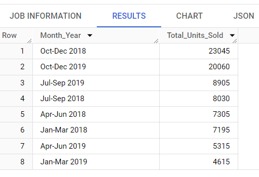
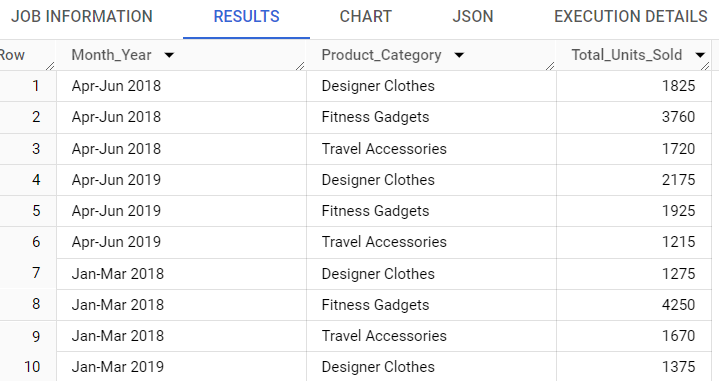
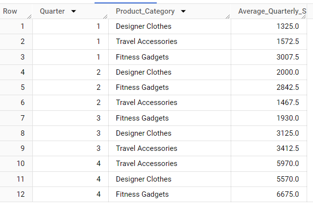
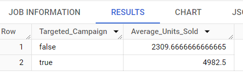
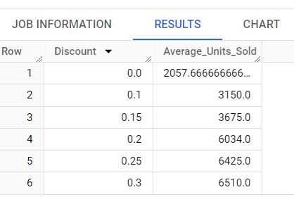
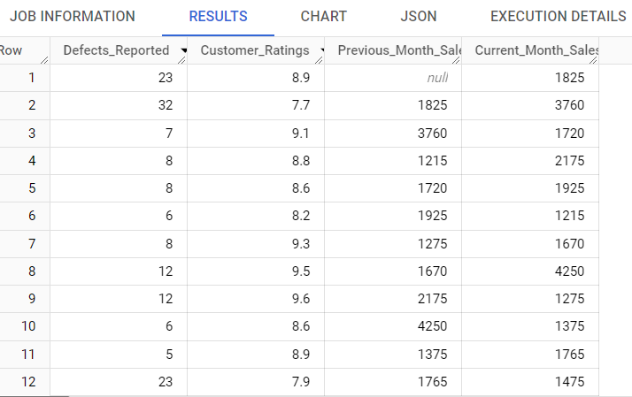
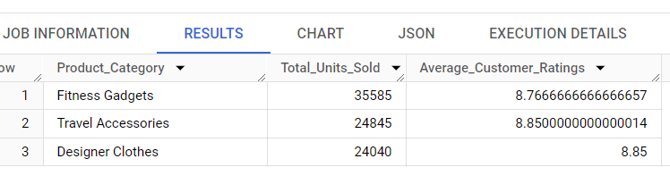
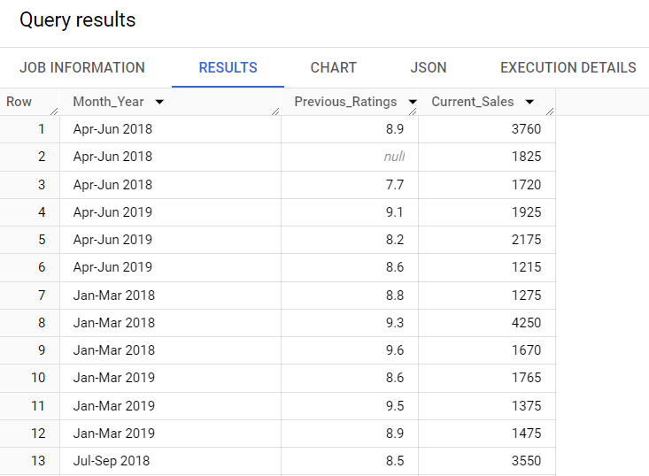
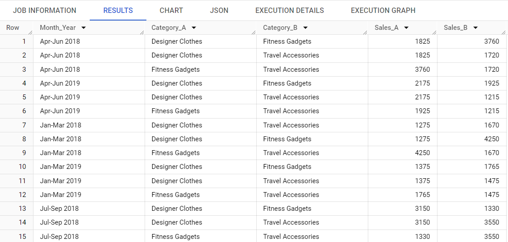
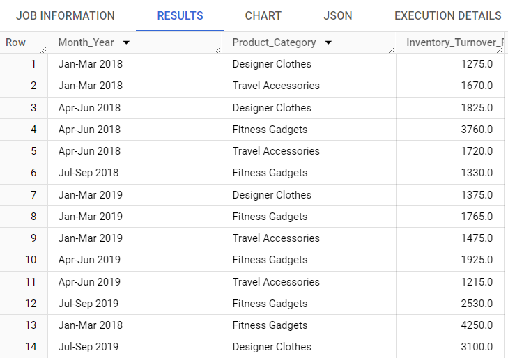

# Data Analysis Project: “Retail Inventory”


## Disclaimer

This analysis is based on the data provided and reflects the state of the dataset as of the time of the analysis. The insights and recommendations are derived solely from my point of view and the dataset in question and do not necessarily represent the broader operations or circumstances of the company. The analysis assumes the accuracy of the data as received and has not been independently verified. Future analyses may yield different insights as new data becomes available or as business conditions change.

## Note on Results

Due to the large volume of results generated by this analysis, only a subset has been presented here to illustrate the key trends and patterns. Specifically, the top 10 to 15 results have been included as screenshots to provide a snapshot of the most relevant findings. For a complete view of the data and to explore additional insights, please refer to the full dataset.

---
# Cleaning the Data
---

## Removing Duplicate Entries.

### Query

```sql
SELECT DISTINCT * FROM retail_store.inventory;
```

### Insights
- All the duplicates removed!

---

## Correcting Formats

### Query

```sql
SELECT
  `Month_Year`, 
  `Product_Category`, 
  `Units_Sold`,
  CAST(REPLACE(CAST(`Discount` AS STRING), '%', '') AS FLOAT64) AS `Discount`,
  `Targeted_Campaign`,
  `Customer_Ratings`,
  `Defects_Reported`
FROM `retail_store.inventory`;

```

### Insights
- This query replaces the % sign in the Discount column with an empty string and casts the result as a floating-point number.

---

## Filter out Rows with Missing Values

### Query

```sql
SELECT *
FROM `retail_store.inventory`
WHERE 
  `Month_Year` IS NOT NULL 
  AND `Product_Category` IS NOT NULL 
  AND `Units_Sold` IS NOT NULL 
  AND `Discount` IS NOT NULL 
  AND `Targeted_Campaign` IS NOT NULL 
  AND `Customer_Ratings` IS NOT NULL 
  AND `Defects_Reported` IS NOT NULL;
```

---
# Deeper Analysis
---

## 1. Descriptive Statistics

### Query

```sql
SELECT
  MIN(`Units_Sold`) AS Min_Units_Sold,
  MAX(`Units_Sold`) AS Max_Units_Sold,
  AVG(`Units_Sold`) AS Avg_Units_Sold,
  STDDEV(`Units_Sold`) AS StdDev_Units_Sold,
  MIN(`Customer_Ratings`) AS Min_Customer_Ratings,
  MAX(`Customer_Ratings`) AS Max_Customer_Ratings,
  AVG(`Customer_Ratings`) AS Avg_Customer_Ratings,
  STDDEV(`Customer_Ratings`) AS StdDev_Customer_Ratings
FROM `retail_store.inventory`;

```

### Screenshot


### Insights

From this above image we can understand that the number of order placed over past years is increased.

- Sales Volume Variability: There is a wide range in the number of units sold, with the minimum at 1,215 and the maximum at 7,125. The standard deviation of approximately 1,989 units suggests significant variability in sales volume across different periods or product categories.
-	Average Sales: The average units sold across all categories and periods is approximately 3,379 units. This figure can serve as a benchmark for evaluating the performance of sales promotions or changes in strategy.
-	Customer Ratings Consistency: Customer ratings show less variability than sales volume, with a standard deviation of about 0.60. This suggests that customers' perceptions of products are relatively consistent over time.
-	Rating Extremes: The range of customer ratings is from 7.1 to 9.6, indicating that even the lowest-rated products are viewed fairly positively. However, there is still room for improvement, given that the ratings do not consistently hit the maximum (which would be 10 in most rating scales).


### Recommendations

- Investigate the Variability in Sales: Explore the factors contributing to the high variability in units sold. Determine if certain product categories or time periods (such as holidays or sales events) are driving the majority of sales, and consider focusing marketing efforts on these areas.
- Target the Lower End of Sales Volume: Identify the products or categories that are contributing to the lower end of the sales volume range and assess why they are underperforming. Consider product improvements, repackaging, bundling with more popular items, or discontinuing low-performers.
- Leverage High Customer Ratings: Use the strong customer ratings in marketing materials and product highlights. Since ratings are generally high, showcasing customer satisfaction could help attract new customers and maintain the loyalty of existing ones.
- Boost the Lower-Rated Products: For products at the lower end of the ratings scale, consider investigating the causes of customer dissatisfaction and implementing product improvements. Additionally, solicit more feedback to understand customer needs and preferences.
- Standardize Excellence: With the highest customer ratings reaching 9.6, strive to make this level of satisfaction the standard. Implement quality control measures or customer service training programs to maintain and elevate the customer experience.


---

## 2. Grouped Aggregations
### A. Aggregate Units Sold by Product Category 

### Query

```sql
SELECT
  `Product_Category`,
  SUM(`Units_Sold`) AS Total_Units_Sold,
  AVG(`Units_Sold`) AS Avg_Units_Sold
FROM `retail_store.inventory`
GROUP BY `Product_Category`;

```
 ### Screenshot


### Insights:

- **Top Seller:** Fitness Gadgets emerge as the best-selling category with a total of 35,585 units sold, averaging 3,954 units per period. This indicates a strong market demand or a successful sales strategy for this category.

- **Consistent Performer:** Travel Accessories also show strong sales with the highest average units sold per period at 3,106, slightly above Designer Clothes. This suggests consistent performance across the periods analyzed.

- **Room for Growth:** Designer Clothes, while not far behind, have the lowest average units sold per period at 3,005. There may be untapped potential in this category.

### Recommendations:

- **Capitalize on the Popularity of Fitness Gadgets:** Given the high sales volume, consider expanding the range of Fitness Gadgets offered, allocate more marketing budget to this category, or explore cross-selling opportunities with other categories.

- **Seasonal or Promotional Strategies for Travel Accessories:** Investigate the periods when Travel Accessories perform best and align marketing strategies to capitalize on these peaks. Consider seasonal promotions or bundling with related categories.

- **Boost Designer Clothes Sales:** To increase sales of Designer Clothes, consider strategies such as introducing a wider variety of styles, offering personalized items, or implementing targeted marketing campaigns, especially if there are specific periods where sales dip.

- **Cross-Category Analysis:** Analyze the data further to understand if the sales of one category benefit from the performance of another. For example, do increased sales in Fitness Gadgets correlate with a rise in sales of Designer Clothes or Travel Accessories?

- **Customer Feedback:** Collect customer feedback specifically related to these categories to understand the driving factors behind the sales figures. Use this information to tailor products and marketing strategies accordingly.

---

### B. Monthly or Quarterly Sales Trends

### Query

```sql
SELECT
  `Month_Year`,
  SUM(`Units_Sold`) AS Total_Units_Sold
FROM `retail_store.inventory`
GROUP BY `Month_Year`
ORDER BY Total_Units_Sold desc;

```

### Screenshot



### Insights:

- **Peak Season Sales:** The Oct-Dec quarters of both 2018 and 2019 show the highest sales volumes, with 23,045 and 20,060 units sold respectively. This suggests a significant seasonal impact, likely due to the holiday season.

- **Year-Over-Year Decline:** There is a noticeable decrease in sales during the Oct-Dec quarter from 2018 to 2019, which could indicate a trend that needs addressing or could be due to external factors impacting sales.

- **Mid-Year Performance:** The mid-year sales in Jul-Sep and Apr-Jun quarters are lower than the end-of-year sales, which is consistent across both years. However, there's an increase in sales from Jul-Sep 2018 to Jul-Sep 2019, which is a positive trend.

- **Start of the Year Sales:** The first quarters (Jan-Mar) of both 2018 and 2019 have the lowest sales numbers, but there's a concerning drop from 2018 to 2019.

### Recommendations:

- **Optimize Inventory for Peak Seasons:** Given the high sales in the Oct-Dec quarters, ensure adequate stock levels during this period to avoid missed sales opportunities.

- **Investigate the Decline:** Examine why there might be a decrease in sales in the Oct-Dec quarter from 2018 to 2019. Assess whether it's due to internal factors like stock issues or external factors such as market trends.

- **Promotional Strategies for Mid-Year Sales:** Develop targeted marketing and sales strategies for the mid-year quarters to boost sales during these lower-performing periods.

4. **Analyze Early Year Sales Drop:** Research the factors contributing to the lower sales at the start of the year, especially the drop from Jan-Mar 2018 to Jan-Mar 2019. This could inform adjustments in sales strategies or promotions to counteract this trend.

- **Plan for Year-Round Engagement:** Implement loyalty programs or marketing campaigns that encourage year-round customer engagement, reducing the reliance on seasonal peaks.

- **Conduct Market Analysis:** Perform a deeper market analysis to understand the competitive landscape, especially during the high-performing months, to ensure the retailer remains competitive during these critical periods.

---

## 3. Trend Analysis

### Query

```sql
SELECT
  `Month_Year`,
  `Product_Category`,
  SUM(`Units_Sold`) AS Total_Units_Sold
FROM `retail_store.inventory`
GROUP BY `Month_Year`, `Product_Category`
ORDER BY `Month_Year`, `Product_Category`;

```

### Screenshot


### Insights:

- **Overall Growth for Designer Clothes:** There is a clear upward trend in sales for Designer Clothes, with significant growth from Apr-Jun 2018 to Oct-Dec 2019, showing the strongest performance in the last quarter.

- **Fluctuations in Fitness Gadgets Sales:** Sales for Fitness Gadgets are more erratic. There was a substantial peak in Oct-Dec 2018, which could be attributed to the holiday season or a successful marketing campaign, followed by a notable decrease in Apr-Jun 2019.

- **Stability in Travel Accessories:** Travel Accessories show some seasonal fluctuation but maintain relatively stable sales, with Jul-Sep being strong periods, possibly reflecting vacation travel seasons.

- **Yearly Growth:** Comparing Oct-Dec 2018 to Oct-Dec 2019, there's significant growth across all categories, especially notable in Designer Clothes and Travel Accessories, indicating an overall positive trend in sales year-over-year.

### Recommendations:

- **Maximize Holiday Sales:** Since all categories show increased sales in the Oct-Dec quarter, a focused strategy on the holiday season can be very effective. Consider bundling products, offering holiday discounts, or increasing marketing efforts during this period.

- **Investigate Fitness Gadgets Fluctuation:** Delve into the reasons behind the high sales of Fitness Gadgets in Oct-Dec 2018 and why there was a drop in subsequent quarters. It's important to understand the factors driving such variability to sustain sales growth.

- **Leverage Travel Accessories Stability:** With relatively stable sales, especially in the Jul-Sep quarters, marketing efforts for Travel Accessories could be amplified during these months to capitalize on the travel season.

- **Increase Year-Round Visibility for Designer Clothes:** Given the overall increase in sales for Designer Clothes, explore opportunities for off-peak promotions to maintain sales momentum throughout the year.

- **Stock Optimization:** Align inventory levels with sales trends to ensure supply meets demand, particularly for peak sales periods identified in the trend analysis.

- **Customer Feedback Collection:** For quarters with lower sales, particularly for Fitness Gadgets, gather customer feedback to better understand purchasing decisions and refine product offerings.

---


## 4. Seasonal Analysis

### Query

```sql
SELECT
  CASE
    WHEN `Month_Year` LIKE 'Jan-Mar%' THEN 1
    WHEN `Month_Year` LIKE 'Apr-Jun%' THEN 2
    WHEN `Month_Year` LIKE 'Jul-Sep%' THEN 3
    WHEN `Month_Year` LIKE 'Oct-Dec%' THEN 4
  END AS Quarter,
  `Product_Category`,
  AVG(`Units_Sold`) AS Average_Quarterly_Sales
FROM `retail_store.inventory`
GROUP BY Quarter, `Product_Category`
ORDER BY Quarter;

```

### Screenshot




---

## 5. Campaign Effectiveness

### Query

```sql
SELECT
  `Targeted_Campaign`,
  AVG(`Units_Sold`) AS Average_Units_Sold
FROM `retail_store.inventory`
GROUP BY `Targeted_Campaign`;

```

### Screenshot




---

## 6. Discount Impact Analysis

### Query

```sql
SELECT
  `Discount`,
  AVG(`Units_Sold`) AS Average_Units_Sold
FROM `retail_store.inventory`
GROUP BY `Discount`
ORDER BY `Discount`;

```
### Screenshot




---

## 7.Defects Impact

### Query

```sql
SELECT
  `Defects_Reported`,
  `Customer_Ratings`,
  LAG(`Units_Sold`, 1) OVER (ORDER BY `Month_Year`) AS Previous_Month_Sales,
  `Units_Sold` AS Current_Month_Sales
FROM `retail_store.inventory`
ORDER BY `Month_Year`;

```

### Screenshot




---

## 8. Product Category Performance

### Query

```sql
SELECT
  `Product_Category`,
  SUM(`Units_Sold`) AS Total_Units_Sold,
  AVG(`Customer_Ratings`) AS Average_Customer_Ratings
FROM `retail_store.inventory`
GROUP BY `Product_Category`
ORDER BY Total_Units_Sold DESC;

```

### Screenshots



---


## 9. Customer Ratings Impact Analysis

### Query

```sql
SELECT
  `Month_Year`,
  LAG(`Customer_Ratings`, 1) OVER (ORDER BY `Month_Year`) AS Previous_Ratings,
  `Units_Sold` AS Current_Sales
FROM `retail_store.inventory`
ORDER BY `Month_Year`;

```



---

## 10. Cross-Selling Opportunities

### Query

```sql
SELECT
  A.`Month_Year`,
  A.`Product_Category` AS Category_A,
  B.`Product_Category` AS Category_B,
  A.`Units_Sold` AS Sales_A,
  B.`Units_Sold` AS Sales_B
FROM `retail_store.inventory` A
INNER JOIN `retail_store.inventory` B
ON A.`Month_Year` = B.`Month_Year` AND A.`Product_Category` < B.`Product_Category`
ORDER BY A.`Month_Year`, A.`Product_Category`;
```
## ScreenShot




---

## 11. Inventory Turnover Ratio

### Query

```sql
SELECT
  `Month_Year`,
  `Product_Category`,
  SUM(`Units_Sold`) / COUNT(DISTINCT `Month_Year`) AS Inventory_Turnover_Ratio
FROM `retail_store.inventory`
GROUP BY `Month_Year`, `Product_Category`;

```
### ScreenShot



---

# **Disclaimer and Limitations**
This analysis is conducted based on data provided to us up to the point of this analysis. The insights, conclusions, and recommendations herein reflect our interpretation of this dataset and do not necessarily represent the views, strategies, or operational status of the company or entity involved. We have relied on the data's accuracy as provided, without independent verification. Future analyses may lead to different insights as new data becomes available or if business conditions evolve.
- Data Privacy and Confidentiality: This analysis respects privacy and confidentiality norms and complies with applicable data protection laws, including, but not limited to, the handling of personally identifiable information (PII). No PII has been disclosed in this report.
- Limitations and Assumptions: This report makes several assumptions for analytical purposes, and its findings are subject to these assumptions' validity. The analysis may exclude certain data segments due to availability, relevance, or other factors deemed appropriate by the analyst. We acknowledge potential biases in data collection and analysis methods and have strived to minimize their impact on our conclusions.
-  Intended Audience: This report is intended for internal stakeholders and strategic decision-making purposes. It should not be considered as financial or legal advice, nor should it be used as the sole basis for any investment decisions.
-	Use of External Data or Sources: Where external data sources or analytical tools have been employed, they are cited accordingly. The inclusion of such sources does not imply endorsement or their accuracy by us. Users are encouraged to consult the original sources for further information.
-	Revision Policy: Given the dynamic nature of data and business environments, this analysis is subject to revisions. Updates or corrections may be issued as new information becomes available or in response to feedback from stakeholders.
-	Non-Endorsement: The mention of any software, platforms, or tools used in the analysis does not constitute an endorsement. These are selected based on their utility for the purposes of this analysis only.
-	Use at Own Risk: The insights and recommendations provided are based on the data and assumptions noted. Stakeholders are encouraged to use this information responsibly and in conjunction with other sources of information, acknowledging the inherent risks and uncertainties in data-driven decision-making.

---

## Thank you!
